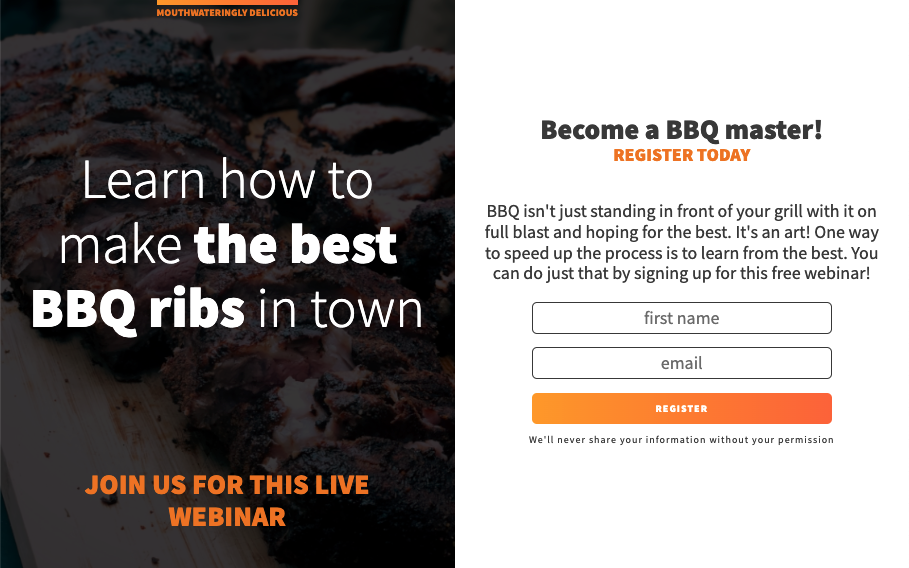
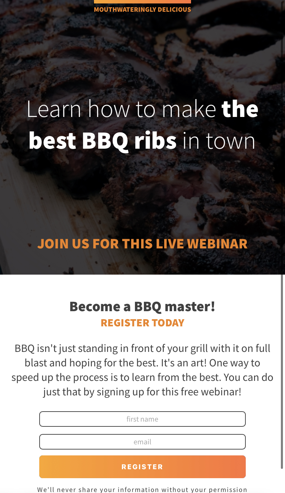

# BBQ Splash Page

A project from the [Scrimba Frontend Developer Career Path](https://scrimba.com/learn/frontend)

## Table of Contents

- [Overview](#overview)
  - [What I Learned](#what-i-learned)
  - [Screenshots](#screenshots)
  - [Links](#links)
  - [Built with](#built-with)

## Overview

### What I Learned

- [x] How to create forms and style them
- [x] Viewport units, background images, gradients, transitions, blending modes
- [x] Line-height, text-transform, letter-spacing

### Screenshots

#### BBQ Splash Page - Desktop

#### BBQ Splash Page - Mobile

### Links

- Live Site URL: [GitHub Pages](https://xchristinawu.github.io/bbq-splash-page/)

### Built With

- HTML, CSS

